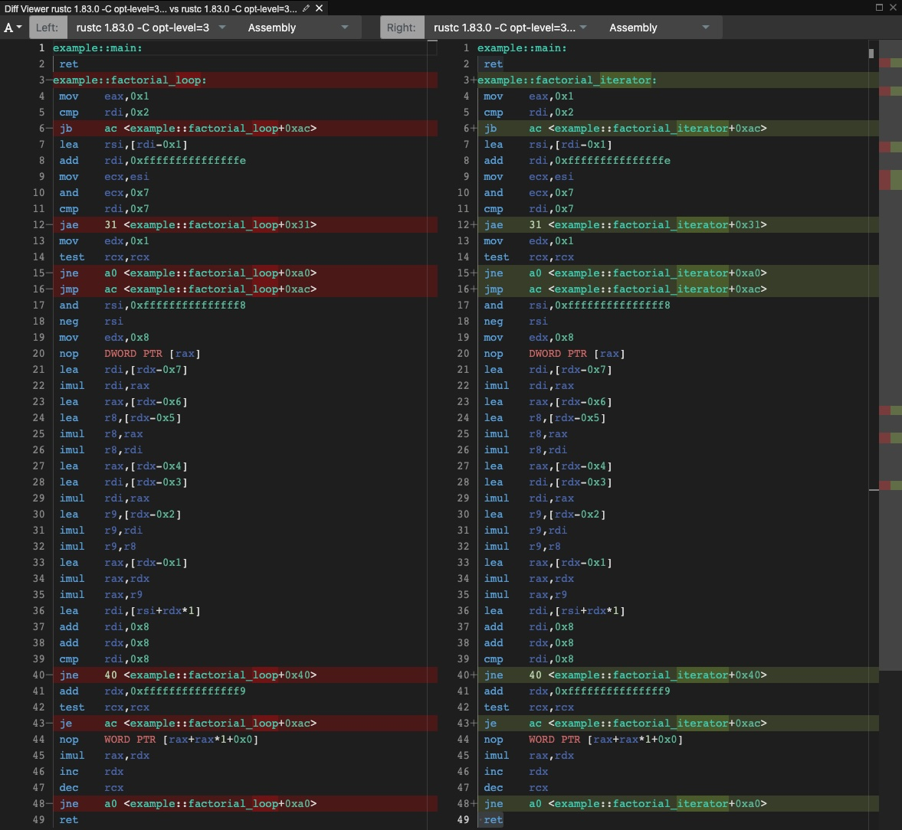

# Walkthrough
## Tooling
### Docs
- Doc comments get turned into an easily accessible website
    - You can use markdown in your documentation
    - You can link to other functions
    - You can write code examples which get compiled and serve as unit tests
- When publishing your crate online your docs get published to docs.rs
```sh
cargo doc --no-deps --open
```

### Test
- Tests can be written in the same file as the source code
    - This gives you access to all private functions
    - Tests can also be written in a special `tests` folder in the root of your package to serve as integration tests (same visibility as users of the crate)
    - tests don't make it into production code because of the `#[cfg(test)]` attribute on the test module
    - every function with the `#[test]` will be run
- If the documentation contains tests they run with the regular unit tests
```sh
cargo test
```

### Benchmarks
- Bechmarks are pretty much the same as tests, except that we're using a different attribute `#[bench]` and the function signature looks a little different
- `black_box` ensures the code we're calling can't get optimized away
```sh
cargo bench
```

### Formatting
Rust has a build in code formatter
```sh
cargo fmt
```

### Linting
Rust has a build in code linter which helps you with common issues and bugs
```sh
cargo clippy
```

## Options
Rust has no `null`, this means that you'll never see `NullPointerException`.

## Ownership
This code works fine in java, but what's wrong with it?
Hint: think about concurrency
```java
class Counter {
   private int count = 0;
   public void increment() {
       count++;
   }
}
```

Rust has a unique ownership model which allows to either have:
- 1 mutable reference
- many immutable references

This makes bugs like the ones above impossible


## Zero cost abstractions
In most languages when adding abstractions, your code becomes slower.

See this example java code with their benchmark results on top:

```java
// Average  10.059 ns/op
public long factorialForLoop(long number) {
    long result = 1;
    for (long i = 1; i < number>; number++) {
        result *= number;
    }
    return result;
}

// Average  23.457 ns/op
public long factorialStream(long number) {
    return LongStream.rangeClosed(1, number)
            .reduce(1, (n1, n2) -> n1 * n2);
}
```

In rust abstractions are zero cost, why?
They compile down to the same assembly code, [proof](https://godbolt.org/z/1bfhGPYnq)

